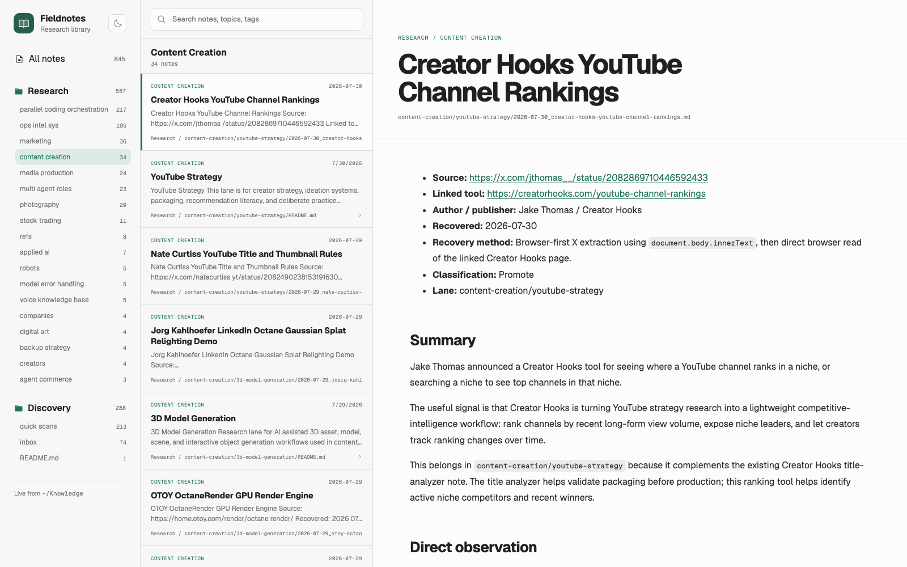

# SimpleResearchSrvc Starter

SimpleResearchSrvc creates a local place to store URLs and useful summaries of resources you want to keep. Give **Codex or Claude Code** a link and it can recover the source, summarize it, preserve the original URL and provenance, classify the note, and save it as durable Markdown.

Sources can be social posts, videos, articles, applications, repositories, documentation, or nearly anything else available online.

The included read-only website provides a searchable, browser-based library of all your saved research notes.

The service runs locally by default and is intended to be exposed privately at a **Tailscale domain**, so your research library can be reached securely from your other tailnet devices without making the portal public.

## Portal example



## What it provides

- one canonical intake/classification workflow shared by both agents
- `Discovery/` for uncertain, partial, and watchlist material
- `Research/<topic>/` for promoted knowledge
- browser-first provenance with direct observation separated from inference
- every submitted resource is saved with exactly one classification: `Watchlist` or `Promote`
- taxonomy-aware routing before new Research topics are created
- Fieldnotes portal with collection/topic browsing, full-text search, stable note URLs, Markdown rendering, local assets, and safe external links
- configurable roots, host, and port
- synthetic examples, templates, setup/backup/deployment docs, and automated acceptance tests

## Quick start

```bash
npm run bootstrap
npm run dev
```

Open `http://127.0.0.1:4210` by default.

To use existing Markdown roots, copy `.env.example` to `.env.local` and change `FIELDNOTES_RESEARCH_ROOT` and `FIELDNOTES_DISCOVERY_ROOT`. Relative paths resolve from the repository root.

## Intake helper

```bash
npm run intake -- \
  --url https://example.org/article \
  --title "Example article" \
  --classification Watchlist \
  --topic browser-recovery \
  --recovery-method browser-body-text \
  --observed "The page explicitly describes a retry sequence." \
  --inference "The sequence may generalize to other dynamic sites."
```

The helper validates classification and routing. Browser recovery itself remains an agent/browser responsibility; the CLI records recovered evidence without pretending to browse.

## Main documents

- [`docs/workflow.md`](docs/workflow.md) — canonical workflow
- [`docs/setup.md`](docs/setup.md) — configuration and local use
- [`docs/backup.md`](docs/backup.md) — Markdown-first backups
- [`docs/deployment.md`](docs/deployment.md) — optional service/Tailscale guidance
- [`docs/clean-install.md`](docs/clean-install.md) — release verification
- [`plan/final/implementation.md`](plan/final/implementation.md) — architecture and acceptance shape

## Safety and portability

The portal performs no writes. Asset and note routes reject path traversal. No remote, hosted dependency, service name, private archive, or machine-specific absolute path is required.
