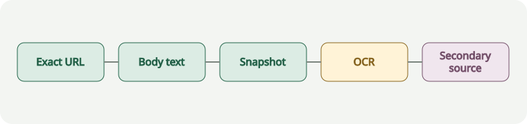

# A resilient source-recovery ladder

## Direct observation

The synthetic guide presents a staged recovery sequence: exact URL, body text, deeper snapshot, screenshot/OCR, then secondary sources.

It says to stop once the primary browser path yields enough evidence and to preserve the method used.

## Inference

The ordering reduces accidental substitution of search snippets for primary evidence.

## Related material

The public [Example Domain](https://example.org/) demonstrates an external link. It should open in a new tab in Fieldnotes.

## Deep-dive questions

1. Which failure modes should trigger screenshot/OCR automatically?
2. How should confidence be represented across mixed recovery methods?
3. When is a cached source acceptable as primary evidence?
